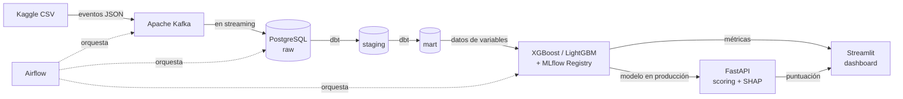

<div align="center">

# CreditLens

**Sistema end-to-end de análisis de riesgo crediticio**

Streaming · MLOps · API de scoring · Dashboard analítico

[](https://www.python.org/)
[](https://fastapi.tiangolo.com/)
[](https://mlflow.org/)
[](https://www.docker.com/)
[](https://opensource.org/licenses/MIT)

</div>

---

## Resumen

CreditLens es un sistema completo de scoring crediticio que cubre el ciclo de vida del dato — ingesta en streaming, transformaciones declarativas, entrenamiento y registro de modelos, scoring en tiempo real y visualización analítica. Predice la probabilidad de que un solicitante caiga en mora grave (90+ días) en los próximos 2 años.

Diseñado siguiendo prácticas reales de la industria financiera: métricas regulatorias (KS, Gini), explicabilidad con SHAP, orquestación con Airflow y CI/CD automatizado.

## Resultados

Modelo en producción entrenado sobre **120,269 registros reales** del dataset _Give Me Some Credit_ (Kaggle):

| Métrica | Valor | Interpretación bancaria |
|---------|-------|-------------------------|
| **AUC-ROC** | **0.8563** | Excelente (>0.80) |
| **KS Statistic** | **0.5536** | Excelente (>0.30) |
| **Gini** | **0.7126** | Excelente (>0.40) |

### Comparación de algoritmos evaluados

| Algoritmo | AUC-ROC | KS | Gini |
|-----------|--------:|---:|-----:|
| **LightGBM** _(producción)_ | **0.8563** | **0.5536** | **0.7126** |
| LightGBM (Tuned) | 0.8539 | 0.5534 | 0.7079 |
| XGBoost | 0.8536 | 0.5510 | 0.7071 |
| XGBoost (Deep) | 0.8503 | 0.5496 | 0.7006 |
| Logistic Regression | 0.7893 | 0.4546 | 0.5786 |

## Arquitectura



| Capa | Tecnología | Responsabilidad |
|------|-----------|-----------------|
| Ingesta | Apache Kafka | Stream de solicitudes en tiempo real |
| Almacenamiento | PostgreSQL 15 | Capa raw + warehouse |
| Transformación | dbt | Pipeline declarativo `raw → staging → mart` |
| Orquestación | Apache Airflow | Programación: ingesta diaria, dbt diario, reentrenamiento semanal |
| ML | XGBoost / LightGBM / scikit-learn | 5 modelos evaluados con métricas financieras |
| Tracking | MLflow | Experiment tracking y Model Registry con promoción automática |
| Explicabilidad | SHAP | Las 3 variables con mayor influencia en cada predicción |
| API | FastAPI + Pydantic | Endpoints REST tipados con OpenAPI |
| Dashboard | Streamlit + Plotly | 5 vistas analíticas interactivas |
| Infraestructura | Docker Compose | Stack completo en un solo `compose up` |
| CI/CD | GitHub Actions | Lint + tests en cada push |

## Características destacadas

- **Pipeline streaming real** — Kafka como fuente, no batch
- **3 capas dbt** — `raw → staging → mart` siguiendo Modern Data Stack
- **5 modelos comparados** — Logistic Regression, XGBoost (2 configs), LightGBM (2 configs) — el de mayor AUC se promueve a Production automáticamente
- **Métricas financieras estándar** — AUC-ROC, KS Statistic, Gini Coefficient (las que reportan los bancos a sus reguladores)
- **Explicabilidad SHAP** — cada predicción viene con las 3 variables que más influyeron
- **API tipada** — Pydantic para validación de entrada y salida, Swagger UI documentado
- **Registro estructurado** — `loguru` en formato JSON, listo para ingestar en ELK/Datadog
- **Configuración por entorno** — `pydantic-settings` + `.env`, cero credenciales hardcodeadas
- **Orquestación con Airflow** — 3 DAGs (ingesta, dbt, retrain) con monitoreo básico de drift
- **CI/CD completo** — GitHub Actions corre lint (black, ruff, isort) + tests en cada push
- **Pruebas reales** — unitarias de transformaciones, simulacros de la API, validación de DAGs

## Dashboard

5 vistas analíticas en Streamlit:

| Vista | Contenido |
|-------|-----------|
| Resumen Ejecutivo | Total de solicitudes, tasa de default, distribución por segmento |
| Exploración de Datos | Histogramas por feature, matriz de correlación |
| Rendimiento del Modelo | Algoritmo activo, AUC/KS/Gini, comparación de los 5 modelos |
| Scoring Manual | Formulario interactivo de scoring + SHAP en vivo + 2 casos de ejemplo |
| Acerca del Proyecto | Stack tecnológico, sobre el autor, contacto |

## Cómo correr localmente

### Prerrequisitos

- Python 3.11
- Docker Desktop
- Git

### Configuración inicial

```bash
# 1. Clonar el repositorio
git clone https://github.com/JuanAlvarezgh/creditlens.git
cd creditlens

# 2. Crear y activar entorno virtual
python -m venv .venv
.venv\Scripts\activate          # Windows
source .venv/bin/activate       # macOS/Linux

# 3. Instalar dependencias
pip install --upgrade pip
pip install -r requirements.txt

# 4. Copiar configuración por defecto
cp .env.example .env

# 5. Levantar infraestructura
docker compose up -d zookeeper kafka postgres
```

### Cargar datos

Descarga `cs-training.csv` de [Give Me Some Credit](https://www.kaggle.com/c/GiveMeSomeCredit/data) y colócalo en `data/`.

```bash
# Crear el topic Kafka
docker exec creditlens-kafka-1 kafka-topics --create \
  --bootstrap-server localhost:9092 \
  --topic credit_applications \
  --partitions 1 --replication-factor 1

# Producir 150k mensajes al topic
python -m ingestion.producer

# Drenar Kafka → PostgreSQL
python -m ingestion.consumer
```

### Pipeline analítico

```bash
# Correr transformaciones dbt
cd dbt_project
dbt run --profiles-dir .
dbt test --profiles-dir .
cd ..

# Levantar MLflow local con SQLite
mlflow server \
  --host 127.0.0.1 --port 5000 \
  --backend-store-uri "sqlite:///mlflow_local/mlflow.db" \
  --default-artifact-root "file:///$(pwd)/mlflow_local/artifacts"

# (en otra terminal) Entrenar los 5 modelos
python -m ml.train
```

### Servicios

```bash
# API de scoring
uvicorn api.main:app --port 8000

# Dashboard
streamlit run dashboard/app.py
```

| Servicio | URL |
|----------|-----|
| Dashboard | http://localhost:8501 |
| API + Swagger UI | http://localhost:8000/docs |
| MLflow UI | http://localhost:5000 |
| Airflow UI | http://localhost:8080 (admin/admin) |

### Probar el scoring

```bash
curl -X POST http://localhost:8000/api/v1/score \
  -H "Content-Type: application/json" \
  -d '{
    "revolving_utilization": 0.45,
    "age": 35,
    "times_30_59_days_late": 0,
    "debt_ratio": 0.25,
    "monthly_income": 5000.0,
    "open_credit_lines": 4,
    "times_90_days_late": 0,
    "real_estate_loans": 1,
    "times_60_89_days_late": 0,
    "dependents": 2
  }'
```

Respuesta:

```json
{
  "probability_of_default": 0.12,
  "risk_level": "Bajo",
  "shap_explanation": [
    { "feature": "revolving_utilization", "impact": 0.34 },
    { "feature": "age", "impact": -0.18 },
    { "feature": "debt_ratio", "impact": 0.09 }
  ]
}
```

## Estructura del repositorio

```
creditlens/
├── api/                  # FastAPI: esquemas, cargador de modelo, endpoints, manejadores de errores
├── airflow/dags/         # 3 DAGs: ingesta, dbt, reentrenamiento semanal + detección de deriva
├── dashboard/            # Aplicación Streamlit — 5 vistas
├── data/                 # Dataset (ignorado por git)
├── dbt_project/          # Modelos dbt + perfiles
│   └── models/
│       ├── staging/      # Limpieza, nulos, valores atípicos
│       └── mart/         # Ingeniería de variables
├── ingestion/            # Productor/consumidor Kafka + utilidades de BD
├── ml/                   # entrenamiento, predicción, métricas financieras + SHAP
├── notebooks/            # Análisis exploratorio (EDA) y razonamiento de ingeniería de variables
├── tests/                # pytest: consumidor, variables, API, DAGs
├── .github/workflows/    # GitHub Actions CI
├── docker-compose.yml    # Kafka, Zookeeper, PostgreSQL, MLflow, Airflow
├── config.py             # Singleton de configuración (pydantic-settings)
├── pyproject.toml        # configuración de black, ruff, isort, pytest
└── requirements.txt
```

## Decisiones técnicas

<details>
<summary><strong>¿Por qué Kafka si los datos están en CSV?</strong></summary>

Para demostrar un patrón realista de producción donde las solicitudes llegan en streaming. En la vida real una API de origen empuja eventos a Kafka, los consumidores los persisten en la capa raw y los pipelines procesan en lote o en streaming.

</details>

<details>
<summary><strong>¿Por qué dbt en lugar de Pandas/SQL puro?</strong></summary>

dbt impone disciplina sobre las transformaciones SQL: tests declarativos, lineage automático, materialización configurable (view vs table), modularidad con `ref()`, y documentación generada. Es el estándar de facto en data warehouses modernos.

</details>

<details>
<summary><strong>¿Por qué evaluar 5 modelos en vez de uno?</strong></summary>

En credit risk no hay un algoritmo claramente ganador a priori: los modelos lineales son más interpretables y exigidos por algunos reguladores, mientras los de árboles (XGBoost, LightGBM) capturan interacciones no lineales. Evaluar varios permite elegir el mejor por métrica financiera (no solo exactitud) con evidencia.

</details>

<details>
<summary><strong>¿Por qué KS y Gini además de AUC?</strong></summary>

AUC mide capacidad discriminativa general. **KS Statistic** mide la máxima separación entre buenos y malos pagadores en un punto del score — es la métrica preferida por bancos para definir cutoffs. **Gini** (= 2·AUC - 1) es lo que reportan al regulador. Tener las 3 da una vista completa.

</details>

<details>
<summary><strong>¿Por qué SHAP para explicabilidad?</strong></summary>

SHAP (Shapley Additive Explanations) es matemáticamente fundamentado en teoría de juegos y produce explicaciones consistentes a nivel global y local. Cumple con requisitos regulatorios crecientes (derecho a explicación en el GDPR, Equal Credit Opportunity Act en EE.UU.) que obligan a explicar por qué se rechaza un crédito.

</details>

<details>
<summary><strong>¿Por qué FastAPI y no Flask?</strong></summary>

FastAPI provee validación automática con Pydantic, documentación OpenAPI generada, soporte async nativo, y rendimiento superior. Es lo que adoptan las empresas que construyen APIs de ML productivas en 2024+.

</details>

<details>
<summary><strong>¿Por qué MLflow y no DVC?</strong></summary>

MLflow cubre los 3 ejes que importan: experiment tracking (parámetros, métricas, artefactos), model registry (versionado y stages), y model serving. DVC se enfoca en versionado de datos, que aquí no es crítico (dataset estático de Kaggle). Para un sistema productivo con reentrenamiento programado, MLflow es más completo.

</details>

## Análisis exploratorio

El notebook [`notebooks/01_eda.ipynb`](notebooks/01_eda.ipynb) documenta el razonamiento detrás de las decisiones de ingeniería de variables:

- Distribuciones univariadas y bivariadas con la variable objetivo
- Análisis de valores faltantes y valores atípicos
- Tasa de mora por intervalos (edad, ingreso, utilización, retrasos)
- Matriz de correlación (Spearman) para detectar colinealidad
- Justificación de cada variable derivada en la capa `mart` de dbt
- Línea base de comparación Logistic Regression vs Random Forest

```bash
# Para abrirlo
.venv\Scripts\activate
jupyter notebook notebooks/01_eda.ipynb
```

## Tests

```bash
pytest tests/ -v
```

Cobertura:
- `test_consumer.py` — unidad del `process_message` del consumer Kafka
- `test_features.py` — funciones de feature engineering
- `test_api.py` — integración del endpoint `/score` (caso exitoso + 5 casos de validación)
- `test_dags.py` — estructura de los 3 DAGs de Airflow

## Calidad de código

- **black** — formateo consistente
- **ruff** — linting rápido (pyflakes + isort + pyupgrade + bugbear)
- **isort** — orden de imports
- **pre-commit** — todo lo anterior antes de cada commit
- **GitHub Actions** — lint + tests automáticos en cada push a `main`

## Autor

**Juan Alvarez** — Estudiante de Ingeniería de Datos y Software, Universidad de San Buenaventura.

## Licencia

[MIT](LICENSE)

---

## Contacto

[](https://www.linkedin.com/in/juanalvarezgh)
[](mailto:juanalvarezghcode@gmail.com)
[](https://github.com/JuanAlvarezgh)
